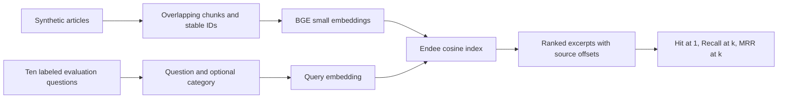

# Support Evidence Search

A new AI-assisted portfolio project by Pratyush Nandan, September 2026.
This repository is a fork of Endee. **The database engine is upstream work.** My
addition is this Python example, its synthetic corpus, evaluation and CI workflow.

Support engineers need a relevant troubleshooting passage and its source, not
an unsupported generated answer. This example embeds ten synthetic support
articles, stores their vectors in Endee, and retrieves source-linked passages
with optional category filters. It returns evidence excerpts; it does not use an
LLM or claim to be a complete RAG answer generator.



The example validates corpus identifiers and embeddings, preserves exact source
offsets, rejects results without source metadata, and checks filter consistency.
Ingestion creates a new index and refuses to replace an existing one. Choose a
new `evidence_` index name when changing the corpus or embedding model.

## Run

Use Python 3.12 and a local Endee v1 server built from this fork. Follow the root
`docs/getting-started.md` instructions, or run the `Support evidence search`
GitHub Actions workflow, which builds and tests the fork's actual server.

```sh
python3.12 -m venv .venv
.venv/bin/pip install -r examples/support_evidence_search/requirements.txt
.venv/bin/python examples/support_evidence_search/search.py ingest
.venv/bin/python examples/support_evidence_search/search.py search --query 'Why is my request rate limited?'
.venv/bin/python examples/support_evidence_search/search.py search --query 'Queries time out waiting for a connection' --category database
.venv/bin/python examples/support_evidence_search/search.py evaluate --output evaluation.json
```

The first embedding call downloads the BGE model through FastEmbed. No paid API
or cloud database account is needed. `--url` defaults to localhost. An optional
`NDD_AUTH_TOKEN` environment variable configures Endee authentication; never
commit credentials. Keep unauthenticated development services local.

The Endee SDK is pinned to `0.1.9` because this public server is the v1 index API;
newer SDK lines use a different collection API. FastEmbed is pinned to `0.7.4`.

## Validation and limits

```sh
cd examples/support_evidence_search
python -m unittest -v
```

Nine tests cover chunk coverage, stable source identifiers, invalid vectors,
evaluation arithmetic, duplicate hits, malformed corpora and relevance labels.
The CI workflow separately performs real model inference, server ingestion,
vector search and filtered retrieval, then uploads the evaluation JSON and logs.
See `VALIDATION.md` for the recorded execution status.

The ten article/query pairs are a synthetic demonstration, not a held-out
production benchmark. Reported similarity is not confidence or answer accuracy.
Returned passages may be irrelevant; a human must inspect them. There is no
tenant isolation, public web UI, generated answer, production deployment or
large-scale performance claim. Category filters are retrieval controls, not an
authorization boundary. No resume, personal data or application credentials are
included in the example corpus.

Upstream references: [Endee](https://github.com/endee-io/endee),
[v1 quick start](https://docs.endee.io/v1/quick-start).
